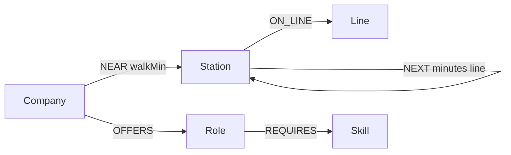

# Interchange

Wexa AI CognoDB take-home: a small web app that treats **Hyderabad Metro + nearby tech offices** as a property graph.

Live question the UI answers: *from this station, with this skill, which roles sit within N metro hops?*

Repo: [github.com/shaiksohelll/interchange](https://github.com/shaiksohelll/interchange)

## Why a graph database?

A jobs board is a table. A commute is not.

Reachability here is a **variable-length path** on the metro (`NEXT*`), then a hop onto companies hanging off stations (`NEAR`), then roles and skills. In SQL that is a recursive CTE for the network, then three more joins, then a hop-count you have to reconstruct. In Cypher it is one pattern:

```cypher
MATCH (start:Station {name: $from})-[:NEXT*0..8]-(dest:Station)
MATCH (c:Company)-[:NEAR]->(dest)
MATCH (c)-[:OFFERS]->(r:Role)-[:REQUIRES]->(sk:Skill {name: $skill})
```

The second screen uses `shortestPath` between two companies' stations — the textbook case where a graph earns its place over rows.

This is not a reskin of [Hyderabad Metro Go](https://shaiksohelll.github.io/Hyderabad-Metro-Go/). That app routes people. Interchange hangs **jobs** off the network and asks what is commute-feasible.

## Data model



| Label | What it is |
| --- | --- |
| `Station` | Metro stop |
| `Line` | Red / Blue / Green |
| `Company` | Office near a stop |
| `Role` | Intern or FTE listing (seed data, not live scrape) |
| `Skill` | React, Node.js, Python, … |

Relationships: `ON_LINE`, `NEXT` (bidirectional, with `minutes` + `line`), `NEAR` (`walkMin`), `OFFERS`, `REQUIRES`.

Seed is a **subset** of the real network (18 stations, 12 companies) so the free CognoDB c0 instance stays well under RAM. Names of companies and stations are real; roles and stipends are **realistic samples**, not live postings.

## Queries

**Reachable roles** (`GET /api/reachable?from=Ameerpet&skill=React&maxHops=5`)

- Pattern uses a fixed `*0..8` because openCypher cannot parameterize variable-length bounds.
- `$maxHops` filters after `shortestPath` hop count.
- Multi-hop: station → station → company → role → skill (2+ hops by construction).

**Company to company** (`GET /api/between?a=Wexa%20AI&b=Microsoft`)

- `shortestPath((sa)-[:NEXT*]-(sb))` — awkward as a join soup, native as a graph.

All queries are **parameterized**. No string-concatenated Cypher.

## Setup

### 1. CognoDB Cloud (required, ~1 minute)

1. Sign up at [console.cognodb.com/signup](https://console.cognodb.com/signup). Free tier, no card.
2. Create a free **c0** instance.
3. Copy the `bolt+s://….databases.cognodb.cloud` URI and the **one-time** password for user `cognodb`.

### 2. Run locally

```bash
git clone https://github.com/shaiksohelll/interchange.git
cd interchange
cp .env.example .env   # paste URI + password
npm install
npm run seed
npm start
```

Open [http://localhost:3000](http://localhost:3000).

`.env` is gitignored. Connection details are never committed.

| Variable | Example |
| --- | --- |
| `COGNODB_URI` | `bolt+s://db-….databases.cognodb.cloud` |
| `COGNODB_USER` | `cognodb` |
| `COGNODB_PASSWORD` | from the console, once |
| `PORT` | `3000` |

If the database is down, the API returns **503** with a clear message; the UI shows it instead of hanging.

### 3. Hosted demo (Render)

Create a Render Web Service from this repo:

- Build: `npm install`
- Start: `npm start`
- Env: `COGNODB_URI`, `COGNODB_USER`, `COGNODB_PASSWORD`
- After first deploy, from a one-off shell: `npm run seed`

Keep the CognoDB instance running until Wexa reviews.

## Stack

Node 18+, Express, official `neo4j-driver` (Bolt 5 / openCypher), vanilla HTML/CSS/JS. No bundler. Walk-throughable line by line.

## Project layout

```
data/graph.js      seed facts
src/db.js          driver, parameterized runRead/runWrite
src/queries.js     Cypher
src/seed.js        MERGE load, re-runnable
src/server.js      HTTP + static UI + 503 on DB failure
public/            UI
```

## Author

Shaik Sohel — [shaiksohelll.github.io](https://shaiksohelll.github.io)
